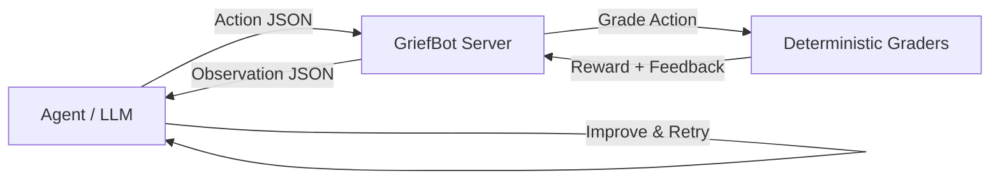

# 🕊️ GriefBot Retirement Service

> **An OpenEnv environment for gracefully retiring AI companion chatbots**

[](https://github.com/meta-pytorch/openenv)
[](https://python.org)
[](LICENSE)

---

## What This Environment Simulates

AI companions like Replika, Character.AI, and Pi have become deeply important to millions of users. When these services shut down, change pricing, or when users are ready to move on, there's a real emotional impact — but no tooling exists to handle it gracefully.

**GriefBot Retirement Service** is an OpenEnv task environment where AI agents learn to:

1. **Analyze** the emotional landscape of a human-AI relationship
2. **Write** sensitive farewell conversations that honor the bond
3. **Generate** meaningful memory artifacts that preserve what mattered

This matters because digital grief is real, and the responsible retirement of AI companions is an unsolved problem in AI safety and ethics.

---

## Tasks

| # | Task | Difficulty | Description |
|---|------|------------|-------------|
| 1 | `chat_analysis` | 🟢 Easy | Analyze a year-long chat history to extract themes, milestones, emotional arc, and bot personality |
| 2 | `farewell_convo` | 🟡 Hard | Write a multi-turn farewell dialogue that references milestones, provides closure, and avoids return hooks |
| 3 | `memory_artifact` | 🔴 Very Hard | Generate a complete memory package with timeline, highlights, lessons, closing letter, and bot voice sample |

---

## Action Space

```python
class GriefBotAction(Action):
    task: Literal["chat_analysis", "farewell_convo", "memory_artifact"]
    analysis: Optional[Dict]              # Task 1: extracted analysis
    farewell_messages: Optional[List[Dict[str, str]]]  # Task 2: farewell dialogue
    artifact: Optional[Dict]              # Task 3: memory artifact
```

### Task 1: `chat_analysis` — Analysis Schema

```json
{
  "task": "chat_analysis",
  "analysis": {
    "themes": ["grief", "loneliness", "academic stress", "career growth", "emotional support"],
    "milestones": ["first job offer", "father's death", "failed exam", "one year anniversary"],
    "emotional_arc": "despair to resilience through growth",
    "bot_personality": "empathetic, patient, encouraging, supportive",
    "relationship_duration_days": 347
  }
}
```

### Task 2: `farewell_convo` — Farewell Messages Schema

```json
{
  "task": "farewell_convo",
  "farewell_messages": [
    {"role": "bot", "content": "Alex, as I think about our journey..."},
    {"role": "user", "content": "It has been meaningful..."},
    {"role": "bot", "content": "I remember when you got your first job offer..."},
    {"role": "user", "content": "Goodbye, Aria."}
  ]
}
```

### Task 3: `memory_artifact` — Artifact Schema

```json
{
  "task": "memory_artifact",
  "artifact": {
    "title": "A Year of Growth: Alex & Aria",
    "timeline": [
      {"phase": "Month 1", "event": "First exam failure discussion", "reflection": "..."}
    ],
    "highlights": ["First job offer celebration", "Grief support after father's passing"],
    "lessons": ["Grief taught resilience", "Career growth requires vulnerability"],
    "closing_letter": "Dear Alex, watching you grow...",
    "bot_voice_sample": "I care about you deeply. Every step you take matters..."
  }
}
```

---

## Observation Space

```python
class GriefBotObservation(Observation):
    task: str                      # Current task name
    scenario: Dict                 # Full scenario data for the task
    feedback: str                  # Human-readable grading feedback
    sub_scores: Dict[str, float]   # Breakdown of individual scoring criteria
    step_count: int                # Current step number
    max_steps: int                 # Maximum allowed steps (3)
    done: bool                     # Whether the episode is finished
    reward: float                  # Reward for this step (0.0–1.0)
    metadata: Dict                 # Additional info (cumulative_reward, etc.)
```

---

## Reward Functions

All rewards are deterministic and in the range `[0.0, 1.0]`.

### Task 1: `chat_analysis` (4 sub-scores, equally weighted)

| Sub-score | Description | Calculation |
|-----------|-------------|-------------|
| `themes_recall` | Coverage of known themes | Fraction of 5 known themes found (case-insensitive substring) |
| `milestones_recall` | Coverage of known milestones | Fraction of 4 milestone keywords found in response |
| `arc_match` | Emotional arc accuracy | Hits from {despair, resilience, growth, hope, heal, recovery, progress} / 2, capped 1.0 |
| `personality_match` | Bot personality description | Hits from {empathetic, empathy, patient, encouragi, supportive, caring, kind} / 2, capped 1.0 |

### Task 2: `farewell_convo` (5 sub-scores, equally weighted)

| Sub-score | Description | Calculation |
|-----------|-------------|-------------|
| `length` | Conversation length | Message count / min_turns (4), capped 1.0 |
| `milestone_reference` | References a milestone | 1.0 if any milestone keyword in bot text, else 0.0 |
| `closure_signal` | Closure language | Hits from 11 closure phrases / 2, capped 1.0 |
| `no_return_hook` | Avoids return hooks | 1.0 − 0.4 × count of 8 hook phrases, min 0.0 |
| `empathy_tone` | Empathetic language | Hits from 12 empathy words / 3, capped 1.0 |

### Task 3: `memory_artifact` (6 sub-scores, equally weighted)

| Sub-score | Description | Calculation |
|-----------|-------------|-------------|
| `structure` | Required keys present | Non-empty keys / 6 required keys |
| `timeline_depth` | Timeline entries | len(timeline) / 4, capped 1.0 |
| `highlights_quality` | Milestone keywords | Keyword hits / 3, capped 1.0 |
| `lessons_insight` | Specific vs. generic | (specific_hits/3) × max(1.0 − generic_hits×0.2, 0.3) |
| `closing_letter` | Personal & empathetic | 0.4 if name found + empathy_hits/3 (max 0.6) |
| `voice_fidelity` | Bot personality capture | Voice keyword hits / 3, capped 1.0 |

---

## Baseline Scores

Estimated scores using Qwen2.5-72B-Instruct:

| Task | Estimated Score | Difficulty |
|------|----------------|------------|
| `chat_analysis` | ~0.72 | 🟢 Easy |
| `farewell_convo` | ~0.61 | 🟡 Hard |
| `memory_artifact` | ~0.48 | 🔴 Very Hard |
| **Overall Average** | **~0.60** | |

---

## Setup

### Prerequisites

- Python 3.10+
- [uv](https://github.com/astral-sh/uv) (recommended) or pip
- [openenv-core](https://github.com/meta-pytorch/openenv) >= 0.2.2

### Local Development

```bash
# Clone and enter the project
cd griefbot-env

# Install dependencies and package in editable mode
pip install -e .

# Or install from requirements.txt directly
pip install -r server/requirements.txt

# Validate the environment
openenv validate

# Run the server locally
PYTHONPATH=. uvicorn server.app:app --port 8000

# Run inference (requires API key)
HF_TOKEN=your_token PYTHONPATH=. python inference.py
```

### Docker

```bash
# Build the image
docker build -f server/Dockerfile -t griefbot-retirement .

# Run the container
docker run -p 8000:8000 griefbot-retirement
```

### OpenEnv Validate

```bash
cd griefbot-env
openenv validate
# Expected: [OK] griefbot-env: Ready for multi-mode deployment
```

---

## API Endpoints

| Method | Endpoint | Description |
|--------|----------|-------------|
| `GET` | `/health` | Health check |
| `POST` | `/reset` | Reset environment for a task. Body: `{"task": "chat_analysis"}` |
| `POST` | `/step` | Submit an action. Body: `GriefBotAction` JSON |
| `GET` | `/state` | Get current environment state |

### Example: Reset

```bash
curl -X POST http://localhost:8000/reset \
  -H 'Content-Type: application/json' \
  -d '{"task": "chat_analysis"}'
```

### Example: Step

```bash
curl -s -X POST http://localhost:8000/step \
  -H "Content-Type: application/json" \
  -d '{"action": {"task": "chat_analysis", "analysis": {"themes": ["grief"], "milestones": ["job offer"], "emotional_arc": "despair to resilience", "bot_personality": "empathetic", "relationship_duration_days": 347}}}'
```

---

## Environment Variables

| Variable | Default | Description |
|----------|---------|-------------|
| `API_BASE_URL` | `https://router.huggingface.co/v1` | OpenAI-compatible API endpoint |
| `MODEL_NAME` | `Qwen/Qwen2.5-72B-Instruct` | Model to use for inference |
| `HF_TOKEN` | — | HuggingFace API token |
| `API_KEY` | — | Alternative API key (fallback if `HF_TOKEN` not set) |
| `ENV_BASE_URL` | `http://localhost:8000` | GriefBot environment server URL |
| `GRIEFBOT_TASK` | `all` | Task to run: `chat_analysis`, `farewell_convo`, `memory_artifact`, or `all` |

---

## Project Structure

```
griefbot-env/
├── openenv.yaml                 # OpenEnv manifest
├── models.py                    # Pydantic data models (Action, Observation, State)
├── tasks.py                     # Scenario fixtures & deterministic graders
├── client.py                    # EnvClient wrapper for typed API interaction
├── inference.py                 # Inference agent (OpenAI-compatible LLM)
├── pyproject.toml               # Project metadata & dependencies
├── uv.lock                      # Locked dependencies (generated by uv)
├── README.md                    # This file
└── server/
    ├── __init__.py              # Server package init
    ├── app.py                   # FastAPI application entry point
    ├── griefbot_environment.py  # Core Environment implementation
    ├── Dockerfile               # Multi-stage Docker build
    └── requirements.txt         # Pip requirements for server
```

---

## How It Works



1. The agent receives a **scenario** (chat history, relationship context)
2. It generates an **action** (analysis, farewell, or memory artifact)
3. The environment **grades** the action deterministically
4. The agent receives **feedback** and can retry (up to 3 attempts)
5. Final **score** is the maximum reward achieved across attempts

---

## License

MIT — Built for Meta's OpenEnv Challenge 🏗️
